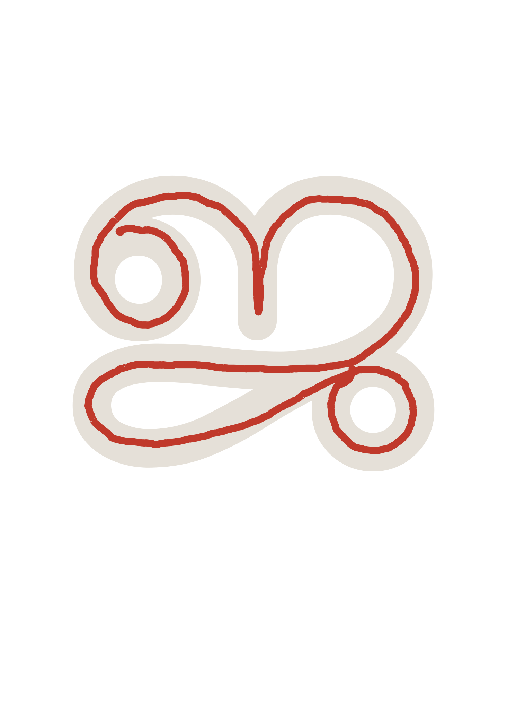
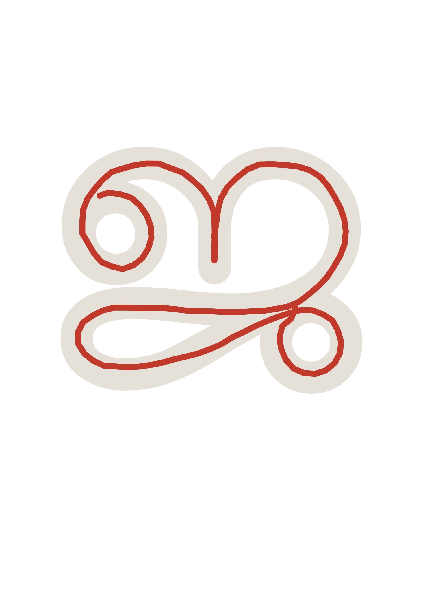
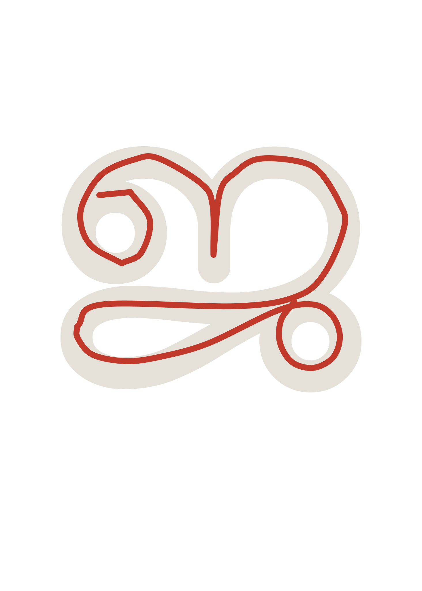

# Jayasree - Architecture

The canonical technical reference for how the stroke pipeline and runtime
composition work, end to end - for anyone (including future-you, or a
contributor extending this to another script) trying to understand the
system without reading every source file. `README.md` covers install/usage;
this doc covers the internals behind it.

For the *why* behind centering/smoothing/straightening specifically -
approaches that were tried and rejected, kept as a record so nobody
re-discovers the same dead ends - see `docs/CENTERING_EXPERIMENTS.md`.

```
tools/build_glyph_data.py     ← run once (or when you change fonts)
        │
        ▼
js/src/glyph-data.json        ← font outlines + advance widths + composable
                                 mark recipes (commit this)
        │
tools/stroke-recorder.html    ← native speakers draw centerline strokes,
        │                        filtered to a reduced "atom" set
        ▼
js/src/stroke-data.raw.json   ← hand-authored strokes, exactly as drawn
                                 (commit this - never overwritten by anything)
        │
        ▼
tools/process_strokes.py --preset=malayalam
        │  (center → smooth → straighten → expand)
        ▼
js/src/stroke-data.json       ← processed + composed (commit this - this is
                                 what the widget loads)
        │
        ▼
js/src/index.js               ← self-contained animator; composes anything
                                 not already baked, at request time
```

## Stage 1 - `build_glyph_data.py`: font shaping

Shapes every Malayalam cluster the font can produce (standalone characters,
consonant+matra, conjuncts, anusvara/visarga combos - ~2050 of them) via
HarfBuzz, and writes their outlines + advance widths to `glyph-data.json`.
This file powers two things: the ghost letterform shown during animation,
and the recorder's ghost reference for drawing over.

It also builds a **`marks` table** - a recipe per *composable mark*
(virama, every matra, the subjoined ya/va/la conjunct tails): shape the mark
alone against HarfBuzz's dotted-circle placeholder (inserted automatically
for a combining mark with no base), then split the result at the circle
into a `prefix`/`suffix`/`shift`/`trailingWidth` recipe. That recipe is
enough to attach the mark onto *any* base cluster generically - see
`_build_marks()`'s docstring in `build_glyph_data.py` for the full
derivation and its accuracy limits (a few vowel signs fuse into
consonant-specific ligature shapes that this generic recipe can't
reproduce; see "Composition" below).

**The reduced atom set.** Not every one of the ~2050 clusters needs its own
recorded stroke. Only ~290-something *atoms* do:

- every standalone character (vowels, consonants, chillu, numerals, virama,
  every matra)
- consonant + {ു, ூ, ృ} and similar vowel signs that fuse into a
  consonant-specific shape in real font rendering (can't be composed
  generically - see below)
- the ~108 conjuncts that form true ligatures (also can't be decomposed)

Everything else - plain consonant+matra, conjunct+matra, dead-consonant
forms, subjoined conjunct tails - composes at runtime from those atoms plus
the `marks` recipe. `tools/stroke-recorder.html`'s dropdown defaults to
showing only this reduced set (with a "show all clusters" toggle for the
full ~2050, useful for spot-checking a composed result), so a contributor
is never misled into thinking they need to hand-draw thousands of
combinations.

## Stage 2 - `stroke-recorder.html`: recording

A browser tool where a native speaker draws over the ghost outline for each
atom. Each pen-down→pen-up gesture becomes one stroke. Exports
`stroke-data.raw.json` - the source of truth, never touched by any
processing step.

One easy-to-miss trap for anyone extending this: if a mark's own standalone
ghost includes a HarfBuzz placeholder circle (any mark shaped alone always
does), the *real content* isn't necessarily at the ghost's origin - for a
suffix-type mark the circle comes first and the content sits after it, at
whatever the circle's own width is (empirically ~1131 font-units in this
font). A stroke drawn over that ghost is anchored there too, not at 0. Both
`process_strokes.py`'s centering/straightening reference and
`js/src/index.js`'s runtime composition (`markContentAnchorX`) need to
correct for this anchor - see "Composition" below for the concrete bug
this caused when it was missed.

## Stage 3 - `process_strokes.py`: processing

Four independently-toggleable stages, applied in order to every raw
stroke, `--preset=malayalam` enabling all four:

1. **Center** - gradient-ascent centering onto the glyph's own ink ridge.
   See `docs/CENTERING_EXPERIMENTS.md`'s centering section.
2. **Smooth** - corner-aware piecewise cubic-spline fit. See
   `docs/CENTERING_EXPERIMENTS.md`'s smoothing section.
3. **Straighten** - ghost-outline-guided angle correction. See
   `docs/CENTERING_EXPERIMENTS.md`'s straightening section.
4. **Expand** - per-glyph composition: a cluster where every character
   already has its own stroke gets one built by offsetting each into place.
   See "Composition" below.

The centering/straightening reference for a given cluster is built from
that cluster's own outline in `glyph-data.json` - for a standalone mark
whose ghost includes the placeholder circle, `process_strokes.py`
specifically excludes the circle from that reference (using the `marks`
table's prefix/suffix classification to know which glyph is the real
content), or the circle becomes a second, spurious "ink" blob the gradient
ascent can wander into.

## Stage 4 - `js/src/index.js`: runtime

Loads `glyph-data.json` (always) and `stroke-data.json` (if present,
gracefully absent otherwise). For each word:

1. **Normalize.** Legacy chillu spellings collapse to their atomic
   codepoint before anything else runs - see "Chillu letters" below.
2. **Segment** the text into clusters (`resolveSegments`) - longest direct
   match first (conjunct+matra → conjunct → consonant+matra), falling back
   to composing a mark onto the previously-matched segment. A registered
   mark that *also* happens to have its own standalone `clusters` entry
   (every matra, after Stage 1) must still prefer mark composition over
   matching itself as a lone standalone cluster - getting this wrong is
   exactly what caused a real, shipped bug (see "Composition" below).
3. For each segment, look for an authored stroke: pre-baked in
   `STROKE_LIBRARY`, or composed on the fly (`tryComposeStroke`), or - last
   resort - traced from the font's own outline contour.

See "Composition" below for how composition actually works, including the
bugs this project hit and fixed while building it out.

## Worked example: one stroke through the pipeline

The stages described above are easiest to understand side by side against
a real stroke. Below is ജ (ja)'s recorded stroke at each stage of
`process_strokes.py --preset=malayalam`, overlaid on its Manjari ghost
outline (light tan): its raw `stroke-data.raw.json` entry, then the same
points run through `centering.center_points`, `geometry.smooth_points`, and
`ghost_reference.refine_stroke` in turn, the same four functions
`process_strokes.py` itself calls, just with each stage's output rendered
as a standalone SVG instead of only keeping the final one. These are static
illustrations, not a maintained build artifact: if ജ's recorded stroke is
ever re-recorded and the pictures fall out of date, regenerate them with a
short one-off script rather than expecting this doc to stay perfectly in
sync automatically.

**1. Raw**: exactly as recorded, dense with mouse/stylus capture noise.



**2. Centered**: gradient-ascended onto the glyph's ink ridge (see
`docs/CENTERING_EXPERIMENTS.md`); still jittery, since centering moves
points but never smooths them.



**3. Smoothed**: corner-aware piecewise local-tangent fit (see
`docs/CENTERING_EXPERIMENTS.md`); jitter gone, corners preserved.


**4. Straightened**: ghost-edge-guided angle correction (see
`docs/CENTERING_EXPERIMENTS.md`). For ജ specifically this stage barely
moves anything visible, since the letter is mostly curved with few long
straight ghost edges to correct against, but the same stage produces a much
more visible correction on straighter letters (e.g. ത, ല).



## Composition: from ~290 atoms to arbitrary words

Most Malayalam clusters - consonant+vowel-sign, consonant+virama,
conjunct+vowel-sign, and the reduced ya/va/la forms used in many
conjuncts - compose predictably from a small base + a reusable recipe,
rather than needing every combination individually shaped or hand-drawn.
This is the part of the pipeline most likely to grow new edge cases as the
project (or a new script built the same way) covers more ground, so it's
worth understanding in more depth - including concrete bugs this project
shipped and fixed, as worked examples of the failure modes to watch for.

### The mark recipe (glyph level)

`build_glyph_data.py`'s `marks` table (Stage 1 above) gives every
composable mark a `{ shift, prefix, suffix, trailingWidth }` recipe.
`js/src/index.js`'s `composeMark(base, mark)` uses it to build a *glyph
outline* for any base+mark pair that isn't already a pre-shaped direct
cluster: prefix glyphs go before the base (shifted by `mark.shift`), the
base's own glyphs shift right by `mark.shift`, and suffix glyphs go after
the base's advance. This is real, HarfBuzz-derived font geometry - always
correct, and unaffected by anything below.

### The same recipe, for strokes (`applyMarkStroke`)

Composing a *stroke* (not an outline) for a mark reuses the identical
shift math, offsetting the mark's own recorded stroke instead of its glyph
outline. This is `js/src/index.js`'s `applyMarkStroke`, mirrored in Python
as `stroke_compose.py`'s `_char_dx`/`compose_per_glyph` for the offline
bake step.

**Bug #1 - the anchor correction, and the regression it can cause.** A
mark's own recorded stroke is anchored wherever its *own* ghost put it - see
Stage 2's note above. For a mark that's always had a proper ghost (like
anusvara), that's fine. But when a matra later *gains* a standalone ghost
for the first time (so it can finally be recorded properly), any code that
composes it needs to know the anchor changed, or it'll silently misplace
every word using that matra. Concretely, on this project: adding standalone
ghosts for all matras retroactively activated the anchor-correction branch
in `stroke_compose.py`'s `_char_dx` for characters that had never been
ghost-aligned - instantly regressing *every already-baked* consonant+aa/i/ii
combination (previously fine only by coincidence, since a blindly-drawn
stroke has no real anchor to get wrong). The fix was a temporary
`NOT_YET_GHOST_ALIGNED` exclusion list (removed once those specific matras
were re-recorded against their real ghost) in both `stroke_compose.py` and
`js/src/index.js` - kept here as a lesson: *adding a ghost to a
previously-blind mark is not purely additive; anything that reads that
mark's own anchor needs re-auditing at the same time.*

**Bug #2 - segmentation must prefer mark composition over a mark's own
direct match.** Once a matra has its own standalone `clusters` entry (Stage
1), it becomes a *valid direct cluster match in its own right* - which
means `resolveSegments`'s longest-match-first scan could match it as a
standalone segment instead of attaching it as a mark to the *previous*
segment. Concretely: typing a conjunct+matra combination rendered with the
matra split off as an orphaned, isolated segment - visibly showing its own
dotted-circle-placeholder ghost shape instead of composing onto the
conjunct. The fix: `resolveSegments`'s direct-match tier only tries lengths
4/3/2 first; length-1 direct matches are tried only *after* mark
composition has already had its chance, and only when there's no previous
segment to attach to (or mark composition genuinely doesn't apply). See
`tests/index.test.js`'s "prefers mark composition over a mark's own
standalone direct match" test for the regression test this produced.

**Bug #3 - a prefix mark's internal shift never got the same tighten trim
as everything else.** `DEFAULT_TIGHTEN_FRACTION` trims a flat amount off
every cluster's own `advance` when accumulating pen position between
clusters (`buildTrace`'s `penX` loop) - compensating for a roughly-constant
trailing-sidebearing gap the font bakes into every glyph's advance width,
regardless of the glyph's own size. A prefix mark's `shift` (literally
where HarfBuzz placed the dotted-circle placeholder when the mark was
shaped alone - see Stage 1's `_build_marks()`) is exactly the same kind of
font-measured, sidebearing-inflated width, used to position the *base*
glyph *within* a composed cluster - but nothing ever trimmed it, so an
intra-cluster gap (e.g. ്ര's base shifted 615 units right of its own
prefix curl) could read as far looser than the (correctly trimmed)
inter-cluster gaps around it, for no principled reason - found via ചന്ദ്രൻ
rendering with what looked like a stray gap between ച and ന്ദ്ര, when the
gap was actually *inside* the ന്ദ്ര cluster itself. Fixed by extending the
exact same trim to prefix-mark shifts (`tightenMarks` in `index.js`, wired
through as a pre-tightened copy of `glyphData.marks` rather than a new
parameter threaded through every composition function) instead of
inventing a separate constant - the point being that every gap in a trace,
inter-cluster or intra-cluster, now narrows by the same fixed amount, so
new marks don't each need their own hand-tuned spacing correction.

**Bug #4 - a prefix mark composing onto a multi-glyph base was assumed
unsafe, and the "safe" fallback was worse than the risk.** `composeMark`
shifts the *entire* base - however many glyphs it has - right as one block
by the mark's `shift`, then prepends the mark's own prefix glyphs at x=0;
nothing about that math cares how many glyphs the base contributes. An
earlier version of `resolveSegments` nonetheless skipped composition
whenever a prefix mark's base had more than one glyph (e.g. "ത്യ", a
2-glyph subjoined conjunct), on the theory - stated in
`_build_marks()`'s docstring, but never actually verified against real
HarfBuzz output for this specific shape (conjunct+prefix-vowel
combinations aren't in the brute-forced `_conjunct_inputs()` set; see that
function's docstring) - that this reordering wasn't safe for a
non-ligating multi-glyph conjunct. In practice the guard's fallback was
strictly worse than the risk it was avoiding: it rendered the prefix mark
as its own isolated dotted-circle-placeholder shape, floating disconnected
from the base it belongs to - visibly broken in real words like
"പ്രത്യേക" (േ prefixing "ത്യ") and "ജ്യോതി". Browser-verified across
several such words with the guard removed, with no observed reordering, so
it was removed; see `resolveSegments`'s docstring in `index.js` for the
current reasoning.

### Compound vowel signs: decompose, don't hand-draw

ൊ/ോ/ൌ each attach *both* a prefix and a suffix piece - one recorded stroke
can't represent that (there's no way to cleanly re-offset a single stroke's
middle gap to match an arbitrary base's width). Rather than hand-recording
these three characters directly, they decompose into their real parts -
which happen to match Unicode's own canonical NFD decomposition exactly:
ൊ→െ+ാ, ോ→േ+ാ, ൌ→െ+ൗ (`SPLIT_VOWEL_PARTS` in `index.js`,
`_SPLIT_VOWELS` in `build_glyph_data.py`). Each part is a simple
single-sided mark, applied one after another (`applySequentialMarkStrokes`)
using the exact same `applyMarkStroke` machinery. ൈ is the one exception -
it has no Unicode decomposition, and in this font renders as a single
prefix-only glyph rather than two, so it's recorded (and composed) as its
own ordinary atom.

A handful of vowel signs (ു/ൂ/ൃ) and the reduced la-form fuse into a shape
unique to the specific preceding consonant in real font shaping and can't
be reconstructed generically - those compose as separate (correct, just
less tightly kerned) parts rather than a true font ligature (see
`glyphData.marks`/`_build_marks()`'s docstring for the full derivation).

### Recursive composition

`tryComposeStroke` doesn't require its base to already be cached in
`STROKE_LIBRARY` - if the base is itself a shorter cluster with no stroke
yet, it's composed recursively first (bottoming out at a real recorded
atom within the cluster's own length, so recursion is always bounded).
This matters for any *chain* of marks: a conjunct+matra combination like
ദ്യു first needs its own base "ദ്യ" (itself `ദ` + the subjoined-ya mark
"്യ") composed before "ു" can attach to it. Before this was recursive, any
mark chain more than one link deep silently fell through to the plain
font-outline trace instead of a real composed stroke - not wrong, just a
visibly different (and, worse, occasionally including a stray
dotted-circle artifact, per Bug #2 above) style from its neighbors.

### Last resort: per-character fallback

If neither direct composition nor mark-chain recursion applies, both engines
fall back to treating every character in the cluster as its own independent
atom and placing each one's own recorded stroke at its own glyph slot
(`stroke_compose.py`'s `compose_per_glyph`, mirrored as
`tryComposeFromCharacters` in `index.js`). This only fires when the
character count exactly matches the glyph count - a mismatch means some
character actually contributes more than one glyph (a mark attachment, not
independent characters placed side by side), and naively mapping characters
to glyph slots 1:1 in that case silently misassigns them (verified
concretely for "കൊ": the base consonant was left unshifted while the
compound vowel's stroke absorbed a shift meant for a different sub-part).
However imperfect the result - no font ligatures, just each atom's own
shape offset into place - it's still closer to the real word than an
outline trace, for any cluster where every character happens to have its
own recorded stroke.

## Whitespace & punctuation aren't handwriting

Spaces and common punctuation (`.`, `,`, `!`, `?`, `;`, `:`, `-`, quotes,
parens - see `UNIVERSAL_CHARS` in `index.js`) are handled entirely
separately from the Malayalam pipeline above: no font-shaping, no ghost
outline, no entry in `glyph-data.json`/`stroke-data.json` at all. They're
recognised directly in `resolveSegments` and rendered as plain static text
with a fixed advance width - there's no "handwriting" to trace for a
period, and no reason to route it through machinery built for animating
letterforms.

This split is deliberate and enforced, not just a convention: the stroke
recorder refuses to let one of these be added as a recordable cluster (both
typed into "Add custom cluster" and if one ever ends up in a loaded
`glyph-data.json`), and `tools/validate_data.py` fails CI if one appears as
a key in any of the three committed data files. It's also why adding a
second language never means touching this - it's checked before any
language-specific `clusters`/`marks` lookup, and stays exactly the same
regardless of which language's data is loaded (see "Adding a new language"
in `CONTRIBUTING.md`).

## Chillu letters: two Unicode encodings, one glyph

A chillu (a consonant's bare final form, e.g. ൻ at the end of "അവൻ") can be
written in Malayalam Unicode two different ways, and both are valid,
standard, and **visually identical in every font** - you cannot tell them
apart by looking, including in this doc:

- **Atomic codepoint** (Unicode 5.1+, the modern form) - one character. `ൻ`
  is `U+0D7B`, a single code point.
- **Legacy sequence** (pre-2009, still what many keyboards, WhatsApp, and
  older CMSs actually produce) - three characters: `consonant + ് (virama,
  U+0D4D) + ZWJ (zero-width joiner, U+200D)`. The same `ൻ` sound is written
  as `ന` (U+0D28) + `്` (U+0D4D) + ZWJ (U+200D) - three code points that
  render as the exact same glyph.

`glyph-data.json`/`stroke-data.json` only have a hand-authored stroke keyed
by the atomic codepoint - duplicating every chillu-bearing entry under a
second, purely-cosmetic 3-codepoint key would be real data duplication for
no visual difference. Instead, `index.js`'s `normalizeChillus()` rewrites
the legacy sequence to its atomic equivalent as the very first step of
`resolveSegments`, before any cluster/mark lookup runs. This is silent,
automatic, and applies to *all six* chillus (ൺ/ൻ/ർ/ൽ/ൾ/ൿ) - callers never
need to know or care which spelling they typed or pasted; both produce the
identical traced stroke, because both are converted to the identical
lookup key before anything else happens. See `LEGACY_CHILLU` in `index.js`
for the exact mapping.
